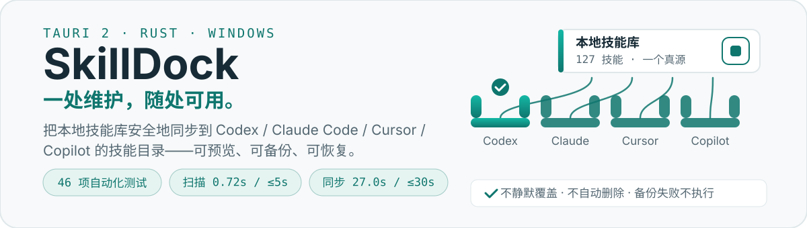
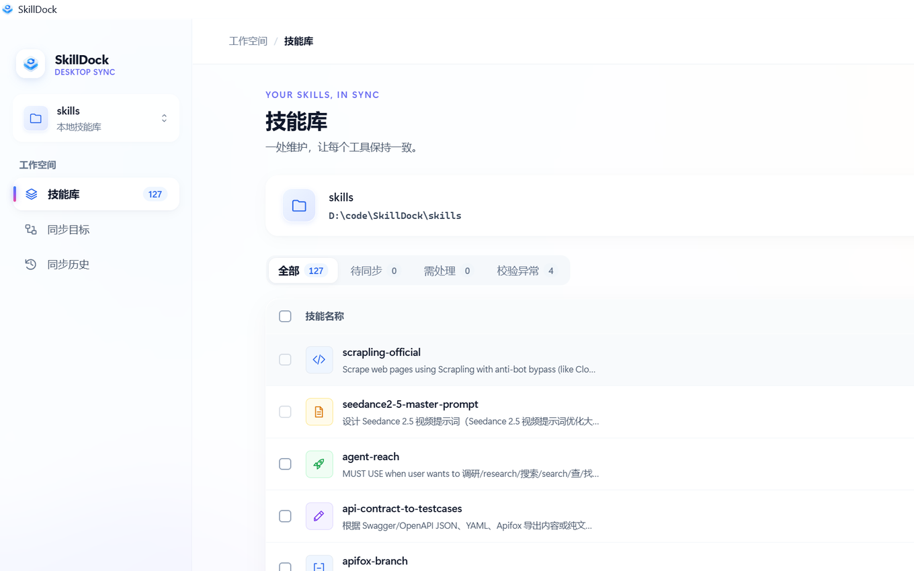
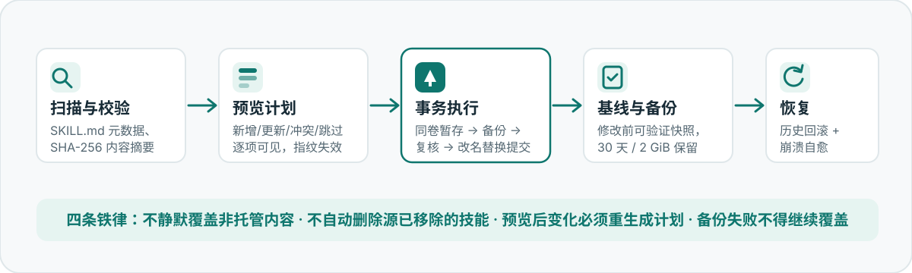

<p align="center">
  
</p>

<p align="center">
  <a href="https://github.com/mrye111/SkillDock/releases"></a>
  
  
  
</p>

**SkillDock** 是一个 Windows 桌面应用：把你维护在本地的 AI 技能库（含 `SKILL.md` 的技能文件夹）安全地分发到多个 AI 编程工具的技能目录——Codex、Claude Code、Cursor、GitHub Copilot（VS Code）或任意自定义目录。

> A Windows desktop app that keeps your local AI skills in sync across Codex, Claude Code, Cursor, and Copilot — preview first, backup always, never silently overwrite.

## 界面

<p align="center">
  
</p>

- **同步矩阵**：技能 × 目标的真实文件状态一览——已同步 / 待更新 / 待新增 / 冲突 / 源已移除。
- **逐项预览**：新增、更新、文件删除、冲突、跳过，以及逐文件变化，执行前全部可见。
- **冲突抽屉**：保留目标、备份后覆盖、接管现有目录、暂停映射，逐项或批量处理。

## 为什么敢让它动你的目录

<p align="center">
  
</p>

- **可验证备份**：更新 / 覆盖 / 接管 / 移除 / 恢复之前先备份并校验摘要；备份失败，该项不执行。
- **单技能事务**：同卷暂存 → 校验 → 复核摘要 → 改名替换 → 提交基线，全程持久化日志。
- **崩溃可恢复**：启动时按磁盘实际状态与事务日志自动恢复；发现未知内容保留现场，绝不覆盖。
- **数据库自愈**：完整性检查失败自动 REINDEX，不可修复则隔离重建——历史记录另有 `文档\SkillDock\SkillDock-操作日志.jsonl` 独立留存。

## 30 秒动一下

<p align="center">
  
</p>

## 快速开始

**方式一：安装包（推荐）** — 到 [Releases](https://github.com/mrye111/SkillDock/releases) 下载：

- `SkillDock-<version>-windows-x64-setup.exe`（标准包，WebView2 缺失时引导安装）
- `SkillDock-<version>-windows-x64-offline-setup.exe`（离线包，内嵌 WebView2 安装组件）

当前用户安装到 `%LOCALAPPDATA%\SkillDock`，免管理员；卸载默认保留配置与历史。

**方式二：从源码运行**

```bash
git clone https://github.com/mrye111/SkillDock.git
cd SkillDock
npm install
npm run tauri dev        # 需要 Rust 工具链与 Node.js
```

**前三步**：添加技能库 → 勾选同步工具 →「预览同步」→ 同步。详见 [用户指南](docs/user-guide.md)。

## 测试与性能

2026-09-09 实测（Windows 11 x64，Release 构建，Defender 实时防护开启）：

| 项目 | 结果 |
| --- | --- |
| 自动化测试 | **46 项全绿**（14 单元 + 32 集成，全部隔离临时目录，不触碰真实目录） |
| 扫描 200 技能 / 5,000 文件 / 92 MiB | **0.72s**（预算 ≤5s） |
| 首次同步 92 MiB 到 3 个目标（含校验与备份） | **27.0s**（预算 ≤30s） |
| 验收核对 | AC-01~AC-32 逐项证据：[docs/acceptance-checklist.md](docs/acceptance-checklist.md) |

## 文档地图

| 文档 | 内容 |
| --- | --- |
| [docs/SkillDock-需求与技术设计.md](docs/SkillDock-需求与技术设计.md) | 产品需求、同步语义、技术架构（规格基线） |
| [docs/user-guide.md](docs/user-guide.md) | 用户指南：首次同步、冲突处理、历史恢复、常见问题 |
| [docs/api-contract.md](docs/api-contract.md) | 前后端接口约定（命令、事件、错误模型） |
| [docs/acceptance-checklist.md](docs/acceptance-checklist.md) | P0 验收核对表（AC-01~AC-32 逐项证据） |
| [docs/adapter-matrix.md](docs/adapter-matrix.md) | 适配器实测版本矩阵（各工具技能目录规则） |
| [docs/THIRD-PARTY-NOTICES.md](docs/THIRD-PARTY-NOTICES.md) | 第三方依赖许可说明 |

## 路线图

- **P0（已完成）**：手动同步闭环、冲突保护、备份与恢复、崩溃自愈、NSIS 标准/离线安装包。
- **P1（规划中）**：文件监听与用户显式开启的自动同步、系统托盘、同步方案、标签与搜索增强、配置导入导出、深色主题、便携 ZIP。

---

<p align="center">
  <sub>本应用只做「文件一致」：技能内容逐字节同步，不代替各 Agent 自身的加载与运行。本地离线运行，无账号、无遥测。</sub>
</p>
