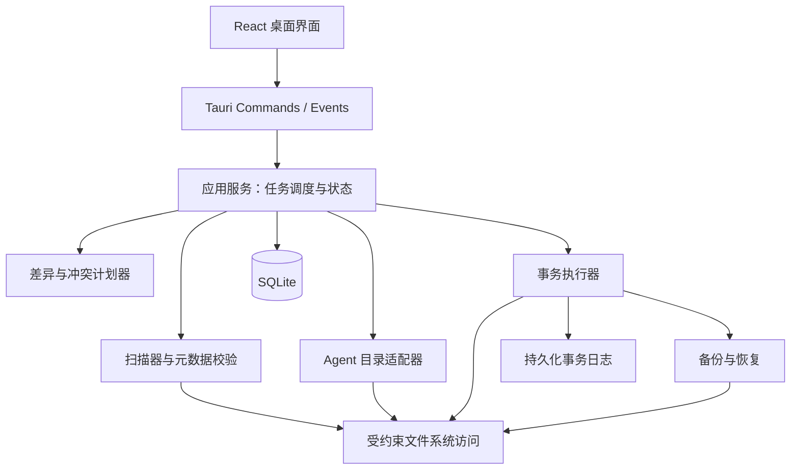

# SkillDock — Windows Skills 同步工具需求与技术设计

文档版本：1.4 · 编写日期：2026-09-08 · 状态：开发需求基线（v1.1：Codex 技能目录按 codex-cli 0.147.0 实测校正为 .codex/skills；v1.2：默认安装位置按 Tauri NSIS 实测更正为 %LOCALAPPDATA%/SkillDock；v1.3：新增文档目录操作日志（SkillDock-操作日志.jsonl）与数据库启动自愈（完整性检查 + REINDEX + 不可修复时隔离重建）要求）

产品名称：**SkillDock**。产品标语：**一处维护，随处可用。**

本文定义一款可打包为 EXE 的 Windows 桌面应用，将本地项目中的 Skills 分发到多个 AI Agent 工具的技能目录。文档覆盖产品需求、交互设计、同步语义、技术架构、安装交付和验收标准，可作为原型、研发拆分与测试的共同依据。

本次交付仅为需求文档。编写时当前工作区 `C:\Users\23167\Documents\ChatGPT\skills` 仅有 Git 元数据，尚未发现实际 Skill 文件。以下名称、数量与界面数据均为产品示例，不代表已经扫描、同步或验证了用户的 Skills。

## 1. 产品决策摘要

| 事项 | 确定方案 |
| --- | --- |
| 核心体验 | 选择本地技能库 → 勾选 Skills 和目标工具 → 预览变化 → 一键同步 |
| 数据方向 | 本地技能库是内容来源，单向同步到目标；目标端修改通过冲突处理保留 |
| 运行方式 | 本地桌面应用，无账号、无服务端；扫描、同步和恢复可离线完成 |
| 第一版目标 | Codex、Claude Code、Cursor、VS Code 中的 GitHub Copilot，以及自定义目录 |
| 同步方式 | 复制整个 Skill 文件夹，保留资源与目录结构；按内容变化决定是否同步 |
| 安全默认值 | 新增、更新；整个 Skill 的删除需要单独预览；已有非托管目录默认保留 |
| 桌面架构 | Tauri 2 + Rust 后端 + React / TypeScript 前端 + SQLite 本地数据 |
| 前端风格 | 简体中文优先，实心浅灰底（#F8FAFC）、纯白工作区（#FFFFFF）、高饱和科技蓝主操作（#2563EB）、深墨锐利文字（#0F172A）；重视高信息密度矩阵表格与即时明确反馈 |
| 安装交付 | Windows 11 x64 为主验收环境；兼容测试 Windows 10 22H2 x64；NSIS 安装 EXE |
| 首版边界 | 先完成手动同步、冲突保护和恢复；自动同步、托盘常驻列入后续版本 |

## 2. 用户、问题与成功标准

### 2.1 目标用户

- 同时使用多个 AI 编程工具，希望统一维护个人 Skills 的开发者。
- 经常调整提示词、脚本和参考资料，希望快速同步到工作环境的高频用户。
- 不熟悉各工具技能目录，希望通过图形界面完成分发的普通用户。

### 2.2 需要解决的问题

| 当前问题 | 产品行为 |
| --- | --- |
| 每个工具目录不同，复制容易漏 | 提供工具预设、目录探测和统一目标管理 |
| 只复制了 SKILL.md，遗漏脚本、模板 | 将 Skill 文件夹作为完整分发单元 |
| 看不出哪一端已经过期 | 用“技能 × 目标”的同步矩阵展示真实文件状态 |
| 目标端有手动修改，容易被覆盖 | 比较源、目标和上次基线，明确标记冲突 |
| 一次同步多个工具，失败后难排查 | 按技能、按目标记录结果，支持只重试失败项 |
| 担心覆盖后无法找回 | 修改前生成可验证备份，并提供目标端历史恢复 |

### 2.3 成功标准

1. 首次使用者在已有有效技能库的情况下，3 分钟内完成首次同步，不需要手动查找目标目录。
2. 完成首次配置后，普通增量同步只需“预览同步”和“同步”两次主操作。
3. 每次执行前可以看到具体目标路径、操作数量和覆盖范围。
4. 不同内容的非托管目录、目标端修改和其他源库占用均不发生静默覆盖。
5. 同步中断后能够识别未完成事务，恢复到可解释状态，不把半份内容标记为成功。
6. 托管技能之外的目标文件保持原样；用户可以恢复仍在保留期内的修改前版本。

这些指标是产品与验收目标，性能和可用性需通过实现后的实测确认。

## 3. 范围与版本优先级

### 3.1 P0：首个可发布版本必须完成

| 编号 | 能力 | 要求 |
| --- | --- | --- |
| FR-01 | 技能库管理 | 添加本地目录、最近打开、切换技能库、手动刷新 |
| FR-02 | 扫描与校验 | 识别 Skills、解析基本元数据、计算内容摘要、展示无效项 |
| FR-03 | 目标管理 | 4 个预设工具、自定义目录、用户级与项目级目标、路径检查 |
| FR-04 | 同步矩阵 | 搜索、多选、状态筛选、按技能设置目标 |
| FR-05 | 同步预览 | 新增、更新、文件删除、冲突、跳过及阻塞项逐项可见 |
| FR-06 | 执行与反馈 | 后台任务、进度、取消、部分失败隔离、按失败项重试 |
| FR-07 | 冲突处理 | 保留目标、用源覆盖、接管同名目录、查看差异 |
| FR-08 | 移除与停止管理 | 默认保留源已删除的目标技能；单独提供托管技能移除 |
| FR-09 | 备份与恢复 | 修改前备份、历史记录、单项或批量恢复、崩溃恢复 |
| FR-10 | Windows 交付 | 安装 EXE、离线安装变体、卸载、单实例、窗口状态记忆 |

### 3.2 P1：增强日常便利性

- 文件变化监听、变更提醒，以及用户显式开启的自动同步。
- 系统托盘、开机启动开关、全局暂停自动同步。
- 同步方案：保存“选定技能 + 目标组合”，例如“日常开发”“内容创作”。
- 本地备注、收藏与用户标签；按名称、描述、目录和标签搜索。
- 设置与映射导入导出；导入后重新绑定路径并停留在预览，不立即执行。
- 深色主题、命令面板，以及经过验证的免安装 ZIP 便携发行版。

### 3.3 P2：按实际需求扩展

- 更多预设适配器、WSL 目录、Windows ARM64。
- 命令行入口、团队共享配置、目标版本兼容性诊断。
- 从目标端导入到新的源库、手动三方合并辅助。

### 3.4 本期不纳入

云端同步、账号体系、技能市场、远程 SSH 分发、在线编辑器、AI 自动改写、自动安装运行依赖、运行技能脚本、Git 拉取提交、Agent 配置迁移、符号链接分发。普通规则文件、MCP 配置和 Agent 插件也不属于本期同步对象。

## 4. 关键概念与目录约定

| 概念 | 定义 |
| --- | --- |
| 技能库 SourceLibrary | 用户选定的一份本地技能集合；可以注册多个，每次界面聚焦一个 |
| 源根目录 SourceRoot | 实际扫描技能集合的目录，由用户选择或从候选中选定 |
| Skill | 含有 SKILL.md 的文件夹及其纳入同步的全部普通文件 |
| 目标 Target | 某工具、某作用域及一个经过确认的技能集合目录 |
| 物理目标 PhysicalDestination | 解析后的真实目录；不同工具可以共用一个物理目标 |
| 映射 Mapping | 某个源 Skill 应同步到某个物理目标的关系 |
| 托管 Managed | 应用记录了该目标技能的归属、上次成功摘要和备份信息 |
| 基线 Baseline | 最近一次成功同步或显式接管后，目标内容的完整文件清单和摘要 |
| 同步计划 SyncPlan | 根据当前源、目标和设置生成的不可变操作集合 |

### 4.1 支持的源结构

**结构 A：当前项目根目录就是技能集合。**

```text
my-skills/
├── code-review/
│   ├── SKILL.md
│   └── references/
├── meeting-notes/
│   ├── SKILL.md
│   └── assets/
└── README.md                 # 集合说明，不分发到每个 Skill
```

**结构 B：技能放在项目中的专门目录。**

```text
my-project/
├── src/
└── skills/
    ├── code-review/SKILL.md
    └── meeting-notes/SKILL.md
```

首次选择项目时，对根目录、`skills/`、`.agents/skills/`、`.claude/skills/`、`.codex/skills/` 等已知位置进行浅层候选发现。只有一个有效候选时自动填入并展示；多个候选时列出数量和路径供选择，不合并不同集合。用户也可直接指定任意源根目录。

选定源根后，只将其直接子目录中的 `SKILL.md` 识别为 Skill。不递归把 references 中的示例技能当成独立项目。单个 Skill 文件夹可用“添加单个技能”模式登记，分发名为其合法目录名。

“当前项目”由用户选中的目录决定。应用安装目录和桌面快捷方式的默认工作目录不得被自动当成技能库；有效的启动目录只作为候选，最近一次打开的技能库优先恢复。

### 4.2 扫描和校验规则

Skill 采用带 YAML 元数据的 `SKILL.md` 加资源文件夹结构，`name`、`description` 为必填项；名称为 1–64 个小写字母、数字或连字符，连字符不能连续或位于首尾，且名称与目录名一致；描述为 1–1024 字符。其他元数据与正文按原始内容保留。[Agent Skills 格式规范](https://agentskills.io/specification)

- 正常项显示名称、描述、相对路径、文件数、体积、最近内容变化时间和目标状态。
- 无效项保留在列表中并说明位置与原因，例如“SKILL.md 第 4 行 YAML 格式错误”。
- 缺少必填字段、名称与目录不一致、冲突名称、文件无法完整读取时，该 Skill 禁止同步。
- 文档使用 UTF-8，读取可兼容 BOM；复制保持原始字节，不转换换行、编码或内容。
- 仅发现元数据中指定的运行依赖或相对路径引用时可提示；这不等于执行兼容性验证。
- 需要外部目录的相对路径、包含符号链接或目录联接的 Skill 标记为不支持，避免分发不完整资源。
- 内部数据库以“库 ID + 相对路径”识别 Skill，不以可变的展示名称作为唯一标识。
- 改名按“新增新名称 + 旧名称待处理”展示，不猜测并自动删除旧目录。

### 4.3 文件纳入与忽略

默认纳入 Skill 目录中的普通文件，包括脚本、参考文档、图片、模板及必要隐藏文件。同步引擎不解释或执行其中的指令。

集合扫描默认跳过 `.git`、`.svn`、`.hg`、`node_modules`、`.venv`、`__pycache__` 和应用事务目录；`.system` 作为工具内置目录不自动纳入。编译产物如 `dist/` 可能是运行资源，不默认排除。

P0 设置页提供源库级忽略模式，沿用相对根路径的 glob 语义，并在预览显示被排除文件及数量。尊重显式配置，不自动把 `.gitignore` 等同于分发规则。忽略配置变化后，必须重新生成计划，已有托管文件因此被移除时必须列为文件删除。无法确定引用是否受影响时提示用户检查，不声称所有依赖完整。

## 5. Agent 目标适配

以下为 2026-09-08 核实的官方目录规则。`<用户目录>` 通常为 `%USERPROFILE%`，`<目标项目>` 指用户另外选定的目标项目根目录。这里的“建议目录”是产品预设，不表示该工具只读取这一个位置。

| 首版适配器 | 用户级建议目录 | 项目级建议目录 | 边界与依据 |
| --- | --- | --- | --- |
| Codex | `<用户目录>/.codex/skills/` | `<目标项目>/.codex/skills/` | 用户级随 `CODEX_HOME` 环境变量变化（默认 `~/.codex`）；2026-09-08 按 codex-cli 0.147.0 本机实测校正（二进制字符串验证）；部分在线文档写 .agents/skills，与实测不符，以客户端实测为准。[Codex Skills](https://developers.openai.com/codex/skills) |
| Claude Code | `<用户目录>/.claude/skills/` | `<目标项目>/.claude/skills/` | 自定义配置目录应考虑 CLAUDE_CONFIG_DIR；保留工具专有元数据。[Skills](https://code.claude.com/docs/en/skills)、[配置目录](https://code.claude.com/docs/en/claude-directory) |
| Cursor | `<用户目录>/.cursor/skills/` | `<目标项目>/.cursor/skills/` | 还会读取 .agents、.claude、.codex 下的兼容技能目录；需识别重复发现。[Cursor Skills](https://prod.cursor.com/docs/skills) |
| GitHub Copilot（VS Code） | `<用户目录>/.copilot/skills/` | `<目标项目>/.github/skills/` | VS Code 也读取用户/项目 .claude 技能目录；官方文档称支持 .agents/skills，本机 Copilot Chat 0.48.1 默认列表未包含（按版本确认，2026-09-09 实测）。[VS Code Agent Skills](https://code.visualstudio.com/docs/agent-customization/agent-skills) |
| 自定义目录 | 用户自行选择 | 用户自行选择 | 将所选目录视为技能集合根，不推断 Agent 的加载规则 |

Codex 的技能目录按实测客户端版本锁定（当前实测：codex-cli 0.147.0 读取 `$CODEX_HOME/skills` 与项目级 `.codex/skills`）；`.agents/skills/` 仅作为可能的历史/文档差异候选展示，不自动双写或迁移。本地发现某个目录存在不能取代版本验证。P0 不管理企业策略目录、Agent 内置技能或插件缓存目录。

Copilot 首版验收限定 Windows 桌面 VS Code 的相关 Agent 功能，不把 Copilot CLI、GitHub 网页端或云端 Agent 自动列为已验证。其他客户端后续作为独立适配器扩展。

**共享读取与重复发现处理：** 由于 Cursor 和 VS Code 能读取兼容目录，写入一个目录可能影响多个 Agent。预览显示“此位置也可能被 Cursor / Copilot 读取”，工具复选框表示选定的分发位置，不能承诺只对勾选工具生效。兼容读取规则依据上述 [Cursor](https://prod.cursor.com/docs/skills) 和 [VS Code](https://code.visualstudio.com/docs/agent-customization/agent-skills) 官方说明。

配置向导先建议各工具的常用目录；如果多个已选工具存在共同支持的位置，则展示“共用一个目录”建议，用户接受后映射到同一物理目标。对不同物理目录中可被同一工具发现的同名 Skill，显示重复候选及内容是否一致；本次计划引入的重复默认不纳入，用户可改用共享位置、取消多余映射，或明确保留多个副本。应用不自动清理既有副本。

适配器记录 `adapterVersion`、`verifiedAt`、`docsUrl`、支持作用域、目录模板及已知读取位置。文档规则已核实与真实客户端已验证分别记录；本次未进行真实 Agent 加载测试，不编造最低兼容版本。P0 发版需在版本说明中填写实际测试过的工具版本与作用域。

### 5.1 目标卡片

每张卡片显示工具名称、作用域、可复制的完整路径、路径来源、目录可用性和关联技能数。检测结果分别表达：

- 发现了应用或配置线索：只证明有相应痕迹。
- 目录存在 / 将创建：描述文件夹情况。
- 可写 / 无权限 / 路径失效：描述实际同步能力。
- 未验证 Agent 加载：磁盘文件一致不代表工具已加载或运行成功。

预设目标默认建议用户级目录，项目级目标要求另选目标项目。目标项目可以不同于源项目。首次不默认勾选全部工具；保存过的选择自动恢复。

目标目录不存在时，可保存配置，在首次执行前预览将创建的完整路径；不依赖已安装 Agent 才能创建用户确认的技能目录。自定义目标需要填显示名称和技能集合目录，承诺按文件夹结构复制，不承诺特定 Agent 会读取。

### 5.2 目标路径规则

1. 模板中的用户主目录、项目目录及环境变量由后端解析，界面同时展示最终路径和解析来源。
2. 不通过执行任意命令或启动 Agent 来检测安装状态。
3. 同一真实目录被多个工具引用时合并成一个物理目标，展示关联工具，并只写入、备份、锁定一次。
4. 用户级与项目级存在同名技能时提示可能的工具加载优先级；精确优先级以各 Agent 文档为准，不擅自删除另一份。
5. 源根与目标根相同、互为父子目录，或多个目标根互相包含时，阻止保存相关映射并说明循环/覆盖原因。
6. 检查大小写折叠、盘符形式、尾部分隔符与真实目录标识；不能仅靠字符串比较判断是否为同一位置。
7. 首版只支持本地磁盘目录；UNC、网络映射盘、WSL 和未就绪云占位文件给出明确说明。普通已落盘的本地文件按实际能力检查。

## 6. 主要用户流程

### 6.1 首次启动：三步完成设置

**步骤一，选择技能库。** 支持文件夹选择器和文件夹拖入。显示发现数量与问题数量；空目录展示“这里还没有找到 Skills”，允许更换目录、打开文件夹或查看结构示例。

**步骤二，选择同步工具。** 展示探测出的目标卡片和“添加自定义目录”。选择作用域后直接展示将写入的位置，未知路径支持修改。

**步骤三，检查并同步。** 默认选择当前有效技能；无效项不勾选。显示新增、更新、冲突和跳过汇总，点击“同步到 3 个目标”开始执行。

### 6.2 日常同步

1. 打开应用，恢复上次技能库、目标和筛选条件，后台刷新状态。
2. 状态矩阵定位需要更新的 Skill；可搜索后批量勾选。
3. 点击“预览同步”，查看操作及逐文件差异。
4. 默认只纳入无冲突操作；冲突区单独显示，需要用户处理后才能纳入。
5. 点击主按钮执行计划，结束后显示完成、失败、跳过及待处理数量。
6. 支持直接查看失败原因、重试失败项、打开目标文件夹或查看历史。

### 6.3 有同名目录或目标端修改

弹出冲突抽屉：左侧源版本、右侧目标版本，可切换上次同步版本。动作包括“本次保留目标”“始终暂停此映射”和“备份后用源覆盖”。

当目录尚未被本应用托管时，覆盖动作明确为“接管并用源覆盖”；当内容相同则可“接管现有目录”，只建立记录，不重复复制。P0 不自动合并正文或改名生成副本，因为目录名与元数据名称需要保持一致。

### 6.4 源 Skill 已删除

目标端保留原目录，状态显示“源已移除，目标保留”。用户可以重新关联来源、停止管理，或进入“移除托管技能”预览。关闭映射只停止后续同步，不删除目标内容。

### 6.5 恢复历史版本

在历史详情选择某次同步中的一个或多个目标技能，查看“当前 → 历史版本”变化，点击“恢复所选目标”。恢复前对当前目标再次做快照，恢复成功生成新记录。

恢复只改变目标文件。源库仍为当前版本，因此矩阵显示“已恢复历史版本，待决定后续同步”，并暂停所涉映射的自动同步，避免立即覆盖恢复结果。用户恢复常规同步时，重新预览。

## 7. 功能细则

### 7.1 技能库和列表

| 功能 | 行为要求 |
| --- | --- |
| 添加技能库 | 允许选择任意可读本地目录；相同真实目录只登记一次 |
| 最近打开 | 展示最近 10 个技能库；可固定常用项；路径失效可重新定位 |
| 移除库记录 | 从最近列表移除并停用映射；历史关联作归档保留，既有托管目录待重新关联，不触碰源文件 |
| 列表字段 | 名称、描述、目标状态、文件数、体积；详细路径放在详情抽屉 |
| 搜索与筛选 | P0 搜索名称、描述、相对路径；筛选待同步、冲突、失败、无效 |
| 批量选择 | 区分“本页/当前筛选结果”和“全部技能”；明确选择数量 |
| 详情 | Markdown 只读预览、资源树、校验结果、逐目标状态及同步历史 |
| 打开位置 | 通过 Windows 文件管理器打开已经验证的路径，不拼接 Shell 命令 |

### 7.2 同步预览

预览按物理目标分组，再列技能；每项显示操作类型、文件变化、备份需求、目标路径和选择状态。首页汇总数字与可执行项一致，不能把冲突或阻塞项算进即将执行的数量。

文本文件支持逐行差异，增删同时用符号和颜色表示。单个文件超过 1 MiB、超过 20,000 行、非 UTF-8 或为二进制时，默认只显示路径、字节数和摘要，可分别打开位置查看。所有被更新技能中的文件删除必须可展开查看。

计划保存生成时的源摘要、目标摘要、配置版本和冲突选择；确认执行前重新验证，文件或配置变化后显示“内容已变化，请刷新预览”，原计划失效。切换主题、排序等展示设置不使计划失效。

### 7.3 同步执行

- 复制并验证完整 Skill；无变化的技能不写入，不刷新时间戳，不制造成功备份。
- 同一个物理目标串行提交；不同物理目标最多同时执行 2 个任务。
- 一个技能失败时保留其原版本或进入恢复状态，其他互不影响的项目继续执行。
- 一个目标的共性错误，如权限失效或磁盘不足，暂停该目标余下操作，其他目标继续。
- “取消”停止未开始项；正在复制的暂存内容可清理，正在提交的单元先完成或回滚再停。
- 进度按阶段、技能数和字节数反馈，不在无法估算时显示虚假百分比。
- 重试重新扫描失败项并生成新计划；不复用过期覆盖决定。
- 整个批次不承诺跨目标全有或全无；成功部分可在历史中单独恢复。

### 7.4 备份与历史

成功更新前和整项移除前必须备份，备份失败则该项不执行。首次创建记录“原先不存在”，以便恢复时删除本应用创建且未被再次修改的目标；显式接管不同内容的目录也必须先备份。

历史展示开始时间、来源库、目标、触发方式、各类数量、结果和耗时；详情包含文件清单、恢复入口和可读错误。日志默认不保存 Skill 正文。

默认保留最近 30 天快照，软容量上限 2 GiB；先清理超过保留期且未被保护的快照，再按时间淘汰可清理快照。每个映射至少保留最近一次可用的修改前备份，未完成事务、用户固定快照不自动删除。超过软上限且无可清理数据时提示用户，空间不足则阻止新写入。被清理快照的历史仍保留，但恢复入口标记“备份已过期”。

备份容量可设置，至少显示已用、可释放和不能清理的占用。恢复前校验快照完整性；快照缺失或损坏时阻止恢复，不将当前目标删除。

普通历史恢复也必须生成新计划，将当前目标与待撤销操作完成后的已知内容比较；存在后续修改或新文件时显示冲突，由用户明确选择后才覆盖。恢复通过第 8.4 节的事务流程执行，并先备份当前内容。恢复成功把实际恢复结果登记为新基线；恢复为“不存在”时记录删除状态。相关映射暂停自动同步，源库不回退；恢复常规同步需重新预览。

### 7.5 P1 自动同步与托盘

默认关闭自动同步。开启时明确选择源库、目标和允许范围；默认仅同步已经授权的映射，后续发现的新 Skill 先提醒，不自动分发。

文件监听合并 1.5 秒内的密集事件；连续两次相隔 500 ms 的状态一致后才生成计划，暂存时仍需复核。事件只触发重扫，不能作为内容一致的依据。应用启动、从睡眠恢复及监听溢出后进行完整校验。

自动模式仅执行无冲突的新增/更新，包含已托管 Skill 内的正常文件增删；整项移除、非托管接管、目标漂移、规则变化导致的大范围删除和权限变化均转为待处理。技能总数突然归零或源根不可读时停止执行，不生成删除计划。

托盘显示空闲、待处理、同步中、失败状态；支持打开窗口、立即检查、暂停和退出。开机启动单独选择，关闭窗口是否驻留首次说明一次。普通同步成功不弹窗打断，只对需要用户操作或失败发通知。

## 8. 同步语义与冲突判定

### 8.1 一致性单位

**管理单位为整个 Skill 文件夹，决策依据为完整文件清单。** 每个文件计算 SHA-256；Skill 摘要由排序后的相对路径、文件大小和文件摘要计算。目录中文件的新增与删除均影响摘要，修改时间仅用于扫描加速提示，不能作为提交时的唯一判断依据。

对已经托管且目标未漂移的 Skill，更新后的目录内容应等于当前源的有效分发清单。因此，源端删除该 Skill 内的某个文件会在更新时删除对应目标文件，并显示在预览中；源端删除整个 Skill 则适用“默认保留”的单独规则。

任何目标端额外文件、文件删除或字节变化都视为目标漂移，包括脚本运行时产生的输出。这类修改默认保留并进入冲突流程，不能因文件名像缓存就静默移除。

### 8.2 决策表

设 `S` 为当前源内容，`T` 为当前目标内容，`B` 为上次托管基线，`∅` 为不存在。校验失败先作为阻塞项处理，不进入下表的覆盖决策。判定顺序为：归属冲突 → 源/目标缺失 → 非托管目录 → 普通内容比较；普通内容比较行均要求 S、T 存在，不能将缺失解释成一次普通更新。B 可以是历史恢复产生的“不存在”标记，该标记属于有托管记录，与从未托管不同。

| 条件 | 状态 | 默认动作 |
| --- | --- | --- |
| 无托管记录，S 存在，T = ∅ | 待新增 | 创建并登记托管 |
| 无托管记录，S = T | 已有相同内容 | 不复制；用户显式接管后建立 B |
| 无托管记录，S ≠ T 且 T 存在 | 同名冲突 | 保留；允许明确接管并覆盖 |
| 有基线，S = T = B | 已同步 | 无动作 |
| 有基线，S ≠ B，T = B | 源已更新 | 更新目标并建立新 B |
| 有基线，S = B，T ≠ B | 目标已修改 | 保留目标，进入冲突 |
| 有基线，S ≠ B，T ≠ B，S ≠ T | 双方已修改 | 保留目标，进入冲突 |
| 有基线，S = T，S ≠ B | 双方内容已一致 | 不复制；核验后刷新 B 并记录状态对齐 |
| 有基线，S 存在，T = ∅ | 目标已删除 | 默认保留删除状态；手动选择重新安装 |
| S = ∅，T 存在 | 源已移除 | 保留目标，等待处理 |
| S = ∅，T = ∅ | 无待同步内容 | 保留历史，结束失效映射 |
| 同一目标名已归属其他源库 | 来源冲突 | 禁止自动抢占，需明确转移归属 |

明确接管、覆盖或转移归属只对当前内容和当前计划有效。即使两个源内容相同，同一物理目标的同名 Skill 也只允许一个有效拥有者。

### 8.3 移除托管技能

“移除”是独立操作，必须列出实际技能目录、当前内容与将影响的工具别名；不能传入一个目标根就清空其中所有文件。

仅当归属匹配、路径仍在目标根内、当前目标等于已知基线时可按常规预览移除；目标已被修改则需要用户看过差异并明确选择“备份当前内容后移除”。未托管目录不提供批量删除。停止管理只撤销记录，不删除磁盘内容。

### 8.4 单技能事务与崩溃恢复


1. 暂存和旧版本工作目录放在技能集合目录之外、同一卷的应用专用兄弟目录，例如 `.claude/.skilldock-transactions/<事务 ID>/`，避免 Agent 将暂存识别为另一个技能。若该保留名称已存在未知内容则阻止使用；应用只清理经事务记录及路径校验确认归属的子目录。
2. 预检父目录写入与重命名权限；无法获得同卷事务空间时阻止执行，不降级成直接覆盖。
3. 持久化事务日志记录意图、旧/新摘要、备份、暂存位置和每次关键重命名的完成状态；日志与备份验证完成才允许变更正式目录。
4. SQLite 事务与文件系统重命名不具备共同原子性。Windows 上替换非空目录采用“移出旧目录，再移入新目录”，会有短暂路径缺席窗口；不承诺运行中的 Agent 看到整个批次瞬时切换。
5. 提交失败时按日志恢复旧目录；自动恢复前检查当前内容符合已知事务状态。发现未知第三方内容则停止并保留现场，由恢复界面引导用户处理，不能覆盖未知内容。
6. 应用启动先扫描未完成事务。依据磁盘实际目录和摘要判断继续登记成功或恢复旧版本；需要处理的目标暂停新任务，其他目标仍可使用。
7. 不跨卷移动正式目录；跨盘源先复制到目标卷暂存，中央备份在原内容仍可用时复制并验证。
8. 普通复制只处理文件数据，不复刻源 ACL、Windows 替代数据流或可执行权限语义；新文件继承目标目录权限。存在硬链接的目标按文件内容快照，替换不修改链接指向的外部文件。

### 8.5 Windows 路径与并发约束

- 使用 Windows 原生路径处理和文件身份检查，支持中文、空格及常见特殊字符；路径展示与实际访问分开处理。
- 拒绝 `..` 越界、绝对路径子项、设备路径、保留设备名、尾点/尾空格歧义，以及大小写冲突。
- 遍历前和提交前检查重解析点；首版不跟随源内容或目标目录链中的符号链接、目录联接等不支持类型。
- 应用内锁覆盖物理目标；单实例锁防止同一用户同时运行多个安装/便携实例。不能假定锁会阻止编辑器或其他进程修改文件，因此提交前必须再次核验。
- 超长路径必须通过最终目标完整路径预检；当前工具适配器或底层 API 无法保证支持时阻塞该项并给出缩短路径建议。
- 备份空间和目标卷空间分别估算，考虑暂存新版本与旧版本同时存在的峰值；预检通过后写入失败仍走恢复流程。

## 9. 前端风格与页面设计

### 9.1 视觉方向：高对比度、清晰、坚实的现代桌面工具

采用符合 Windows 桌面用户习惯的高信息密度界面：实心不透明背景、左侧稳定导航、中间高密度同步矩阵、右侧详情抽屉和底部浮动操作栏。
**彻底废除全屏半透明毛玻璃（`backdrop-filter: blur`）与大面积环境模糊光斑（`.ambient`）**，消除发虚、发灰和雾蒙蒙的不清晰感，确保长时间高频使用下的文字锐利度与视线聚焦。

| 设计项 | 规格标准 | 说明 |
| --- | --- | --- |
| 布局形式 | 窗口 100vw × 100vh 铺满无留白 | 消除四周空白与内嵌壳间隙，最大化利用桌面屏幕空间 |
| 默认主题 | 实心明亮浅色主题（Solid Colors） | 彻底摒弃半透明叠层，文字笔画坚实，反差鲜明 |
| 背景 / 面板 | `#F8FAFC`（Slate-50） / `#FFFFFF`（纯白实底） | 主背景与面板分层清晰，边框坚实 `#E2E8F0`（Slate-200） |
| 主文字 / 次级 | `#0F172A`（深墨 Slate-900） / `#475569`（深中灰 Slate-600） | 文字对比度达 7:1 以上，消除发灰感，长时间阅读不疲劳 |
| 品牌主色 | `#2563EB`（科技蓝 Blue-600），悬停 `#1D4ED8`，高亮浅底 `#EFF6FF` | 用于主要操作按钮、选中态徽章与复选框高亮 |
| 分界与边框 | 默认 `#E2E8F0`（Slate-200），强调/聚焦 `#CBD5E1`（Slate-300） | 实线分界，无模糊阴影干扰 |
| 状态识别色彩 | 已同步 `#16A34A`（绿）、待同步 `#2563EB`（蓝）、冲突 `#D97706`（橙）、异常 `#DC2626`（红）、已暂停/未选择 `#64748B`（灰） | 状态药丸必须同时具备标准图标、色彩与文字说明 |
| 字体体系 | `system-ui, -apple-system, Segoe UI, Roboto, Helvetica, Microsoft YaHei UI, sans-serif`；代码和摘要使用等宽字体 | 严格适配 Windows 系统的 ClearType 字体渲染特性 |
| 窗口尺寸 | 默认 1280 × 820 DIP，最小 960 × 640 DIP | 窄窗口时侧边栏收拢图标，矩阵表格支持平滑横向滚动 |

### 9.2 信息架构

```text
SkillDock
├── 技能库 (Workbench)      主工作台：多库切换、源根识别、矩阵表格、搜索筛选、抽屉详情
├── 同步目标 (Targets)        适配器探测、目录配置、作用域解析、目录快捷定位
├── 同步历史 (History)        任务时间线、状态分组、备份容量看板、快照回溯与版本恢复
├── 系统设置 (Settings)       .gitignore 语法忽略规则动态管理、快照保留天数与容量软上限
└── 抽屉与弹窗体系           技能详情、同步计划预览与差异对比、任务执行动画、冲突与崩溃恢复
```

### 9.3 同步矩阵与核心交互规范

```text
┌─────────────────────────────────────────────────────────────────────────────────────────────┐
│ SkillDock           Personal Skills ▾       D:\Workspace\skills           刷新 (F5)  ─ □ × │
├────────────┬────────────────────────────────────────────────────────────────────────────────┤
│            │ 技能库                                                         添加技能库      │
│ ● 技能库   │ 127 个技能 · 1 个目标已关联 · 目录正常                                          │
│   同步目标 │                                                                                │
│   同步历史 │ [搜索技能名称或描述...]     全部(127)  待同步(8)  冲突(0)  异常(1)                 │
│            ├──────┬──────────────────────┬──────────────┬──────────────┬────────────────────┤
│            │ [✓]  │ 技能名称              │ [✓] Codex    │ [-] Cursor   │ [□] Claude Code    │
│            ├──────┼──────────────────────┼──────────────┼──────────────┼────────────────────┤
│            │ [✓]  │ code-review          │ ✔ 已同步     │ ➜ 待同步     │ + 未选择           │
│            │      │ 检查代码变更并提出建议 │              │              │                    │
│            │ [✓]  │ meeting-notes        │ ✔ 已同步     │ - 已暂停     │ + 未选择           │
│            │      │ 整理会议结论与行动项  │              │              │                    │
│            │ [□]  │ legacy-export        │ ⚠ 校验异常   │ ⚠ 校验异常   │ ⚠ 校验异常         │
│            │      │ 缺少 description 字段 │              │              │                    │
│            ├──────┴──────────────────────┴──────────────┴──────────────┴────────────────────┤
│ 设置       │ [123] 已选择 123 个技能 · 2 个物理目标已开启                                     │
│            │ 关联目标: [● Codex ✓]  [● Cursor 82]  [○ Claude Code]           [预览同步 →]  │
└────────────┴────────────────────────────────────────────────────────────────────────────────┘
```

#### 1. 列头三态复选框（Column Three-State Checkbox）
- **布局规范**：`[Checkbox] [ToolIcon] [目标名称]`，紧凑排列，仅占 15px 宽度，避免文字按钮挤压列宽导致折行破版；
- **自适应扩展能力**：支持未来横向扩展至 5~10+ 个 Agent 列（如 Codex, Claude, Cursor, Copilot, Windsurf 等），表格横向滚动排版始终规整稳定；
- **三态智能逻辑**：
  - **全选 (`✓`)**：当前列所有有效技能均已关联；点击一键全部取消关联；
  - **半选 (`-`)**：当前列部分技能已关联、部分未关联；点击一键全部关联补齐；
  - **未选 (`□`)**：当前列技能均未关联；点击一键全部开启关联；
  - 悬停浮现 Tooltip 详细状态（如 `Cursor · 部分关联 (82/123) · 点击关联全部有效技能`）。

#### 2. 底部浮动操作栏（SelectionDock）多目标快捷胶囊
- 当用户在列表中勾选某些技能时，底部浮动操作栏升起，不仅展示已勾选数量，还以**紧凑微型胶囊（Pills）**呈现当前配置的所有 Agent 目标：
  - `[● Codex ✓]`：所选技能已全部开启该目标；点击即可一键全部取消；
  - `[● Cursor 82]`：所选技能中部分已关联该目标；点击为所选项全部开启；
  - `[○ Claude Code]`：所选技能尚未关联该目标；点击一键批量加入；
- 用户无需在宽表格中来回横向滚动逐列寻找，在底栏即可一次性完成跨 Agent 目标批量配置。

#### 3. 映射状态生命周期与安全机制（已暂停 vs 未选择）
针对取消勾选后的状态呈现做权威区分，杜绝心智困惑：
- **`未选择` (`no_mapping`)**：该技能从未向该目标同步过，目标端本地磁盘无任何落地文件，数据库无映射记录；
- **`已暂停` (`paused`)**：遵循 **AC-14 保护规则（“取消勾选/停止管理：仅停止映射，不删除磁盘文件”）**：
  - 当技能之前处于“已同步”或已有落地文件时，取消勾选时系统**绝不静默删除**目标 Agent 目录下的本地文件；
  - 后端将其记录置为停用（`enabled = false`），保留历史基线与快照，停止后续自动推送；
  - 前端显示为 `- 已暂停`，悬停气泡明确提示：*“已停止自动同步：目标端仍保留上次同步的文件，不再接收更新；如需彻底清理目标文件，可在抽屉中执行‘预览移除’。”*
- **彻底清除机制**：如需从目标 Agent 目录中物理抹除该技能，点击技能打开右侧抽屉，在危险区执行【预览移除】计划。

### 9.4 重点页面与组件体系

| 页面 / 模块 | 组件路径 | 核心能力与交互 | 主操作 |
| --- | --- | --- | --- |
| **技能库工作台** | `src/views/workbench/` | 技能库切换与登记、磁盘真实扫描、状态矩阵、搜索与 4 态筛选（全部/待同步/冲突/异常）、全选 | 预览同步 (Ctrl+Enter) |
| **浮动操作栏** | `src/components/workbench/SelectionDock.tsx` | 统计所选技能与目标数、多目标胶囊快捷切换关联、进入同步预览 | 预览同步 |
| **同步目标管理** | `src/views/targets/` | 展示适配器可用性探针与真实解析路径、物理目标去重合并、在文件管理器定位目录、添加/删除目标 | 添加同步目标 |
| **同步历史与恢复** | `src/views/history/` | 时间线按天分组展示任务状态与明细、备份容量面板与软上限、快照追溯、恢复计划生成与执行 | 恢复所选目标 |
| **系统设置** | `src/views/settings/` | 实时编辑 `.gitignore` 规则格式的忽略列表（动态添加/删除）、调整快照保留天数与软上限 | 保存配置 |
| **技能详情抽屉** | `src/components/drawers/SkillDetailDrawer.tsx` | 元数据展示、YAML 校验错误行号与原因提示、各目标映射独立开关与保存、危险区【预览移除】入口 | 保存目标选择 / 预览此技能 |
| **同步预览抽屉** | `src/components/drawers/SyncPlanDrawer.tsx` | 树形呈现受影响目标与变更文件、逐文件差异对比（DiffViewer）、冲突选项单选决策、指纹防漂移 | 执行同步计划 |
| **执行进度弹窗** | `src/components/modals/TaskProgressModal.tsx` | 订阅后端事件，展示九阶段事务推进动画、分项处理状态与进度条、支持安全请求取消 | 取消任务 / 完成自动刷新 |
| **崩溃恢复弹窗** | `src/components/modals/RecoveryModal.tsx` | 监听 `recovery://required` 事件，展示未竟事务现场，提供“安全回滚”或“继续提交”引导 | 开始恢复 / 暂不处理 |

### 9.5 前后端事件流与时序契约

根据 Tauri 2 运行机制，前后端异步调用遵循以下严格时序契约：

1. **合法事件名标准**：Tauri 2 事件名使用冒号规范（点号非法）：
   - `scan://progress`：扫描实时进度（扫描目录数、已发现技能数、异常数）；
   - `sync://progress`：同步执行阶段（staging, verifying, backup, committing, cleanup, item_done）；
   - `sync://completed`：任务终态事件（包含各状态统计数量及执行耗时）；
   - `recovery://required`：启动发现未决事务时广播的强恢复通知。
2. **扫描与读取时序闭环**：
   - 技能列表由后端 SQLite 存储，`get_library` 只读数据库而不重复扫描磁盘；
   - 登记库（`register_library` / `select_library_root`）及日常刷新（F5）必须先调用 `scan_library`，等待 `sync://completed` 事件确认后再调用 `get_library` 渲染最新状态。
3. **单技能目录自愈**：
   - 当使用 `auto` 模式登记单技能目录返回 `sourceRoot = null` 时，前端自动拦截并以 `mode: 'single'` 重新登记并触发扫描。

### 9.6 键盘快捷键与无障碍

| 快捷键 | 作用场景 | 行为说明 |
| --- | --- | --- |
| `Ctrl + O` | 全局 | 打开技能库切换 / 登记弹窗 |
| `Ctrl + F` | 工作台 | 快速聚焦矩阵顶部搜索框 |
| `F5` | 全局 | 触发重新扫描当前技能库并刷新界面 |
| `Ctrl + Enter` | 工作台 | 对当前勾选的技能快速打开同步预览计划抽屉 |
| `Esc` | 全局 | 关闭当前打开的抽屉或弹窗（不打断正在执行中的后台任务） |

所有交互支持键盘 Tab 导航，具备焦点指示器；状态药丸兼具色彩、图形与明确的文字说明，严格适配 Windows 100%、125%、150%、200% 桌面缩放。

## 10. 技术架构

### 10.1 技术选型

| 层级 | 选型 | 用途与理由 |
| --- | --- | --- |
| 桌面容器 | Tauri 2 | 承载本地前端、Windows 窗口、系统对话框和安装打包 |
| 前端 | React + TypeScript + Vite | 构建状态清晰、可复用的桌面交互 |
| 组件与样式 | Radix UI + Tailwind CSS + Lucide 图标 | 基础交互、统一视觉和可访问性；具体依赖版本开发时锁定 |
| 状态 | TanStack Query + 轻量 UI store | 前者管理扫描和任务数据，后者仅管理选中、筛选、抽屉等界面状态 |
| 本地后端 | Rust + Tauri Commands | 路径、扫描、摘要、计划、复制和恢复全部集中在后端 |
| 持久化 | SQLite，Rust 侧访问 | 存储配置、映射、基线、任务和迁移版本；不向前端开放 SQL |
| 文件校验 | SHA-256 + 确定性清单 | 判断字节变化、验证暂存和备份 |
| 监听 | Rust notify 类文件监听库，P1 | 作为重扫触发源，配合防抖及完整校验 |
| 交付 | NSIS 安装 EXE | 当前用户安装、快捷方式、卸载和升级 |

应用选择 Tauri 的原因是本项目以本地文件操作为主，前端只需要表达状态和差异，能够把关键文件逻辑集中到 Rust。Windows 分发采用 Tauri 支持的 NSIS 安装方式。[Tauri Windows 安装文档](https://v2.tauri.app/distribute/windows-installer/)

前端仅加载随应用分发的资源，采用最小化 Tauri capabilities；后端对自定义命令继续独立校验注册目录和实际路径，不能把 UI 提交的路径视为已授权。[Tauri capabilities 文档](https://v2.tauri.app/security/capabilities/)

### 10.2 模块结构



模块边界：扫描器只读文件；计划器只生成操作，不执行写入；执行器只运行后端登记的有效计划；适配器提供目录和格式能力，不包含复制引擎；恢复复用同一个受约束的文件访问层。

### 10.3 实际工程目录结构

```text
skilldock/
├── src/
│   ├── views/               # 四大主视图（workbench 工作台, targets 目标, history 历史, settings 设置）
│   ├── components/
│   │   ├── common/          # 基础组件（Badge 状态药丸, Drawer, Modal, DiffViewer 差异对比, Icon, Toast）
│   │   ├── drawers/         # 业务抽屉（SkillDetailDrawer, SyncPlanDrawer, TargetDetailDrawer, HistoryDetailDrawer）
│   │   ├── modals/          # 业务弹窗（TaskProgressModal, RecoveryModal, AddTargetModal, AddLibraryModal 等）
│   │   ├── workbench/       # 工作台组件（SelectionDock 浮动操作底栏与目标快捷胶囊）
│   │   └── layout/          # 外层布局（AppLayout, Sidebar, TopBar）
│   ├── context/             # AppContext 全局状态机（扫描异步时序、多选关联、事件监听、自愈）
│   ├── services/            # api.ts (Tauri IPC 真实通信与安全降级)、mock-data.ts、environment.ts
│   ├── lib/                 # backend-contract.ts (与后端 api-contract.md 镜像的 TypeScript 类型安全守卫)
│   └── styles/              # index.css (高对比度深墨/科技蓝 Windows 桌面样式体系)
├── src-tauri/
│   ├── src/
│   │   ├── commands/        # 26 个 Tauri IPC 命令薄封装
│   │   ├── scanner/         # 磁盘扫描器与元数据校验
│   │   ├── adapters/        # Agent 目标静态注册表与探针
│   │   ├── planner/         # 同步计划器与 15 态矩阵决策表
│   │   ├── executor/        # 九阶段事务执行器与持久化事务日志
│   │   ├── recovery/        # 启动自愈与崩溃恢复
│   │   ├── storage/         # SQLite 存储层与迁移
│   │   └── windows_paths/   # Windows 原生受限路径校验
│   ├── capabilities/        # 最小权限声明 (default.json)
│   ├── icons/               # 桌面应用各分辨率图标
│   ├── tauri.conf.json      # 标准版桌面容器配置 (SimpChinese 语言)
│   └── tauri.offline.conf.json # 离线安装变体配置
├── tests/                   # 后端 26 项集成测试与 11 项单元测试
└── docs/                    # 需求与技术设计、API 契约、原型设计
```

### 10.4 前后端接口约定

| 命令 | 主要输入 | 结果 |
| --- | --- | --- |
| `register_library` | 已选择目录、展示名称、扫描模式 | 库 ID、候选根、路径诊断 |
| `scan_library` | 库 ID | 扫描任务 ID；分批推送状态 |
| `save_target` | 适配器 ID、作用域、已选择目录 | 目标 ID、物理目标 ID、可用性 |
| `create_sync_plan` | 库 ID、映射集合、操作类型 | 计划 ID、操作清单、冲突与阻塞 |
| `resolve_conflict` | 计划 ID、项 ID、选择 | 新计划版本与摘要 |
| `execute_sync_plan` | 计划 ID、确认的计划版本 | 任务 ID |
| `cancel_task` | 任务 ID | 取消请求状态 |
| `list_history` | 分页、库/目标/状态筛选 | 任务摘要与下一页游标 |
| `create_restore_plan` | 历史项 ID 集合 | 恢复计划及当前目标差异 |
| `open_registered_path` | 库/目标/历史项 ID | 打开受信任位置或结构化错误 |

执行接口不接受任意“源路径 + 目标路径 + 覆盖开关”，由后端根据登记对象和计划解析实际路径。事件按 `scan.progress`、`sync.progress`、`sync.completed`、`recovery.required` 分类，包含任务 ID 与递增事件序号，前端重连后可查询任务快照。

错误模型统一包含 `code`、用户可读信息、操作上下文、是否可重试和诊断 ID；至少区分权限不足、文件占用、空间不足、计划失效、非法路径、目标漂移、备份失败及恢复待处理。

## 11. 数据与本地存储

### 11.1 主要实体

| 实体 | 关键字段 |
| --- | --- |
| Library | ID、展示名、规范路径、真实目录身份、扫描模式、忽略配置、配置版本 |
| Skill | ID、库 ID、相对路径、name、description、当前摘要、校验状态 |
| Target | ID、适配器 ID/版本、作用域、路径配置、物理目标 ID |
| PhysicalDestination | ID、规范路径、真实目录身份、可用状态 |
| Mapping | ID、库/技能 ID、物理目标 ID、目标目录名、启用状态、拥有者、暂停原因 |
| Baseline | 映射 ID、摘要、文件清单、成功任务 ID、时间 |
| SyncPlan | ID、版本、源/目标摘要、配置指纹、操作与用户决策、失效状态 |
| SyncTask / TaskItem | ID、触发类型、状态、进度、项结果、错误、前后摘要 |
| Snapshot | ID、项 ID、原先是否存在、备份位置、摘要、体积、保留状态 |
| RecoveryTransaction | ID、项 ID、阶段、暂存/旧目录位置、恢复状态 |

对活动映射建立“物理目标 ID + 目标目录名”的唯一约束。任务最终状态包括全部完成、部分完成、失败、已取消、待恢复；跳过和冲突按项统计，不能混为成功。

### 11.2 存储位置

```text
%LOCALAPPDATA%/SkillDock/
├── app.db
├── backups/<快照 ID>/
├── journals/<事务 ID>.json
├── logs/
└── cache/
```

另设独立于数据库的长期可读操作记录：每个任务完成时向 `%USERPROFILE%/Documents/SkillDock/SkillDock-操作日志.jsonl`（文档目录，跟随系统重定向）追加一行 JSON（时间、任务、状态、计数、逐项结果）。数据库损坏或重装不影响该文件；文档目录若被 OneDrive 等同步，仅追加的单行日志无并发写风险。

数据库记录映射归属，不向用户的技能文件夹注入管理标记。数据库丢失或首次在新电脑使用时，既有目标一律按非托管目录处理；不根据同名猜测拥有权。

升级前备份数据库，再执行版本化迁移；迁移失败恢复备份并报告，不删除源或目标文件。日志默认保留 14 天，内容上限 100 MiB；诊断导出由用户主动触发，默认隐藏用户名和完整本地路径，也不包含技能正文。

导出的配置不包含快照和绝对路径授权。P1 导入需重新确认路径；备份和数据库的迁移应作为独立迁移操作处理。

## 12. Windows 安装、打包与交付

### 12.1 发行物

| 发行物 | 要求 |
| --- | --- |
| `SkillDock-<version>-windows-x64-setup.exe` | P0 标准 NSIS 安装包，检测 WebView2，缺失时引导安装 |
| `SkillDock-<version>-windows-x64-offline-setup.exe` | P0 离线安装包，包含 WebView2 离线安装组件 |
| `SkillDock.exe` | 安装后的桌面程序；EXE 运行仍依赖可用 WebView2 Runtime |
| `SkillDock-<version>-windows-x64-portable.zip` | P1 免安装包；明确运行时要求及数据保存位置 |

Tauri 的 Windows 运行依赖 WebView2；标准包可使用引导安装模式，离线包选择包含运行时安装组件的方式。离线版包体明显更大，分别设定验收预算，不把标准 EXE 宣传为完全无依赖的单文件程序。[Tauri WebView2 安装选项](https://v2.tauri.app/distribute/windows-installer/#webview2-installation-options)

### 12.2 安装体验

- 默认当前用户安装到 `%LOCALAPPDATA%/SkillDock`（Tauri NSIS 模板默认，2026-09-08 安装实测），创建开始菜单入口，桌面快捷方式可选。
- 应用日常运行不要求管理员权限。WebView2 安装受系统策略限制时，给出明确安装结果和处理入口。
- 同步目录与应用程序目录分离；升级不修改源 Skills、目标 Skills 或丢弃历史。
- 卸载默认保留用户数据；只有在用户勾选“清除应用设置和备份”后删除应用自己的数据目录，仍不删除源库或 Agent 技能目录。
- 不默认开机启动、不默认常驻托盘。检测旧版本正在执行同步时先完成/安全取消任务，再安装更新。
- 公开分发版本进行程序与安装包签名并提供 SHA-256；内部验证可使用明确标记的测试包。签名不承诺消除所有系统信誉提示。

### 12.3 构建和发布流程

在 Windows 构建机上固定 Node、包管理器、Rust 工具链及依赖锁文件，执行前端检查（TypeScript 类型检查 `tsc`）、Rust 检查（`cargo check`）、核心测试、前端 Vite 构建（`npm run build`），再执行 Tauri 的 Windows NSIS 打包（`npm run tauri build`）。
标准版和离线版使用独立构建配置，共享应用版本和代码：
- **NSIS 语言规范**：配置必须使用 `SimpChinese` 标识符（NSIS 官方简体中文标准）；
- **实测标准交付物**：
  - 标准版安装包：`src-tauri/target/release/bundle/nsis/SkillDock_0.1.0_x64-setup.exe`（实测 **2.79 MB**，远优于 ≤ 40 MiB 预算）；
  - 独立可执行程序：`src-tauri/target/release/skilldock.exe`（实测 16.8 MB，解压即用）。

每次发布交付安装包、校验值、版本说明、依赖许可说明和安装/卸载测试记录。P0 不需要自动更新服务；P1 可加入用户主动检查和确认更新。

## 13. 非功能要求

以下性能均为待实测的工程预算，基准环境为 Windows 11 x64、4 核 CPU、16 GiB 内存、本地 NTFS SSD、WebView2 已就绪，使用 Release 构建。源文件为普通文本和小型资源，排除杀毒全盘扫描等异常干扰。

| 项目 | 验收目标 |
| --- | --- |
| 启动 | 冷启动到窗口可交互 ≤ 3 秒，扫描不阻塞交互 |
| 常规库扫描 | 200 个 Skills、5,000 个文件、总计 100 MiB，完整扫描 ≤ 5 秒 |
| 大列表 | 1,000 个 Skills、4 个目标状态列可操作；列表虚拟化，搜索反馈 ≤ 200 ms |
| 同步 | 100 MiB / 5,000 文件到 3 个独立物理目标，含校验与必要备份 ≤ 30 秒 |
| 界面响应 | 复制、计算摘要、备份不占用 WebView 主线程；长操作立即显示进行状态 |
| 内存 | 基准库空闲总工作集目标 ≤ 250 MiB，测量包含相关 WebView2 子进程 |
| 安装体积 | 标准 x64 安装包目标 ≤ 40 MiB；离线包记录实测体积并单独披露 |
| 正确性 | 成功项的文件清单和摘要等于计划内容；同计划重复检查应幂等 |
| 稳定性 | 文件占用、磁盘写满、程序被终止后的状态可恢复或明确进入待恢复 |
| 隐私 | 核心功能不上传任何 Skills 或目录信息；P0 无遥测、无广告、无云端依赖 |

预览中的 Markdown 关闭原始 HTML 执行，远程图片不自动加载，外部链接由用户点击后交给系统浏览器。前端不具备任意 Shell 执行权限。上述要求只保护本应用的查看和分发过程，不代替 Agent 执行技能时自身的权限机制。

## 14. 验收场景

所有文件操作测试必须在隔离临时目录中进行，不使用真实用户的 Agent 技能目录。真实 Agent 加载验证使用专用测试项目和可识别的测试 Skill。

| 编号 | 场景 | 通过标准 |
| --- | --- | --- |
| AC-01 | 空仓库首次打开 | 显示空状态，不报程序异常，不创建或删除目标文件 |
| AC-02 | 根目录技能集合与 skills 子目录 | 都能发现正确候选；多个候选要求明确选择 |
| AC-03 | Skill 内有示例 SKILL.md | 不被当成额外独立 Skill |
| AC-04 | 完整资源分发 | SKILL.md、脚本、模板和图片按清单复制，摘要一致 |
| AC-05 | 无效 YAML 或重名 | 明确定位问题，仅阻止相关项；不改写源内容 |
| AC-06 | 首次同步到不存在目标 | 预览将创建目录，确认后创建，记录托管基线 |
| AC-07 | 重复同步相同内容 | 无文件写入、无多余备份，状态为已同步 |
| AC-08 | 源中一个 Skill 更新 | 仅更新需要变更的托管 Skill，其他目录不变 |
| AC-09 | 托管 Skill 内部文件删除 | 预览列出文件删除；更新后清单与源一致，旧文件可恢复 |
| AC-10 | 未托管同名目录 | 内容不同默认跳过；显式接管前不覆盖 |
| AC-11 | 目标独自修改或删除 | 显示目标漂移；源未改变也不自动覆盖或重建 |
| AC-12 | 双方修改 | 显示冲突，可查看差异并保留目标 |
| AC-13 | 源整个 Skill 删除或改名 | 原目标默认保留，整项移除需单独预览 |
| AC-14 | 取消勾选/停止管理 | 仅停止映射，不删除磁盘文件 |
| AC-15 | 多工具共享一个真实目标 | 只执行一次复制和一次备份，别名状态一致 |
| AC-16 | 多个源库抢占同名目标 | 唯一归属约束生效，不能后台互相覆盖 |
| AC-17 | 预览后源/目标被编辑 | 旧计划拒绝执行，提示重新预览 |
| AC-18 | 一个目标无权限或文件占用 | 对应目标失败/暂停，其他目标独立完成，错误包含路径 |
| AC-19 | 备份失败或磁盘不足 | 正式目标保持可解释状态，未备份内容不进入覆盖步骤 |
| AC-20 | 提交各阶段强制终止程序 | 重启后根据日志恢复/确认结果，无未知内容被静默覆盖 |
| AC-21 | 复制和提交时取消 | 未开始项取消，当前项完成或回滚，结果逐项明确 |
| AC-22 | 恢复覆盖、移除和首次新增 | 分别恢复旧内容、重建旧目录、撤销未漂移的首次创建；源不变 |
| AC-23 | 恢复前目标又被编辑 | 显示当前差异，保存当前快照，未经选择不覆盖 |
| AC-24 | 备份过期/损坏 | 历史说明不可恢复，当前目标不变 |
| AC-25 | 路径越界、目录联接、重叠根 | 写入前被阻止，错误解释可理解 |
| AC-26 | 中文空格、大小写、长路径 | 合法路径可用，歧义或不支持路径有明确阻塞理由 |
| AC-27 | 数据库丢失 | 目标重新视为未托管，不自动清理或接管 |
| AC-28 | 安装、升级、卸载 | 干净虚拟机通过；设置按选择保留，源与目标技能始终保留 |
| AC-29 | 离线安装 | 无网络且缺失 WebView2 的测试系统可用离线安装包启动和同步 |
| AC-30 | 缩放、键盘和错误阅读 | 100% / 150% / 200% 可操作；所有关键操作可键盘完成 |
| AC-31 | Agent 实际加载 | 每个首发适配器在记录的工具版本与作用域下加载测试 Skill；文件一致与加载结果分开报告 |
| AC-32 | 不同目录被同一工具读取 | 提示重复候选和额外读取工具；新增重复先处理，不能声称只对勾选工具生效 |

测试重点应放在同步决策、文件边界、失败恢复和 Windows 安装。单纯静态文案、颜色和低风险布局调整使用针对性检查，不为复述实现新增重复测试。

## 15. 开发阶段与完成定义

| 阶段 | 工作范围 | 出口条件 |
| --- | --- | --- |
| M1：可运行骨架 | Tauri 工程、视觉基线、源目录选择、真实扫描和有效性检查 | 安装包可启动，能展示真实本地技能，空态/错误态可用 |
| M2：同步闭环 | 适配器、目标配置、矩阵、计划、首次复制与校验 | 从本地源到多个目标的新增/更新流程可用 |
| M3：可信文件操作 | 基线、冲突、备份、取消、恢复、路径与崩溃处理 | 破坏性和故障验收场景全部通过 |
| M4：P0 发布 | 历史、交互打磨、性能、真实 Agent 验证、标准/离线安装包 | P0 验收通过，版本矩阵与发布说明齐全 |
| M5：P1 便利功能 | 监听、自动同步、托盘、方案、配置迁移、深色主题 | 自动化不会绕过冲突和删除规则 |

不以“页面已完成”替代功能完成。每项 P0 必须包含正常状态、空状态、错误状态、取消/重试行为和相应验收结果。排期在 M1 验证 Windows 文件操作与适配器路径后细化，不把未经估算的日期作为承诺。

## 16. 产品边界与发布前需锁定的事实

1. **工具目录会随版本演进。** 适配器数据必须包含核实日期、官方链接和验证版本；应用允许修改路径。发版时锁定测试矩阵，不能仅根据目录存在宣称兼容。
2. **文件同步不等于可执行。** Skill 可能依赖 Bash、Python、特定工具或平台能力；原样复制后，由 Agent 和用户环境决定是否可运行，界面区分内容一致与加载验证。
3. **备份不是无限存储。** 可恢复范围由快照保留策略决定，历史中需明确过期状态；空间问题不能通过跳过备份解决。
4. **外部进程仍可能改文件。** 自有锁和摘要重检降低冲突，但不构成跨程序协作事务；检测到未知内容时保留现场并请求处理。
5. **当前源目录为空。** 不依赖本次工作区存在示例技能；开发样本单独放在测试目录，应用不自动向用户目录植入示例。

## 17. 研发交付清单

- 可维护的前后端源码、依赖锁文件及版本化数据库迁移。
- 统一设计变量、核心页面及全部关键状态。
- 源扫描、适配器、计划器、执行器和恢复模块。
- Windows 隔离集成测试、故障注入测试及安装测试记录。
- 经过实际工具验证的适配器版本与作用域矩阵。
- 标准安装 EXE、离线安装 EXE、校验文件、版本说明。
- 简短用户指南：首次同步、冲突处理、恢复历史、常见路径与权限问题。
